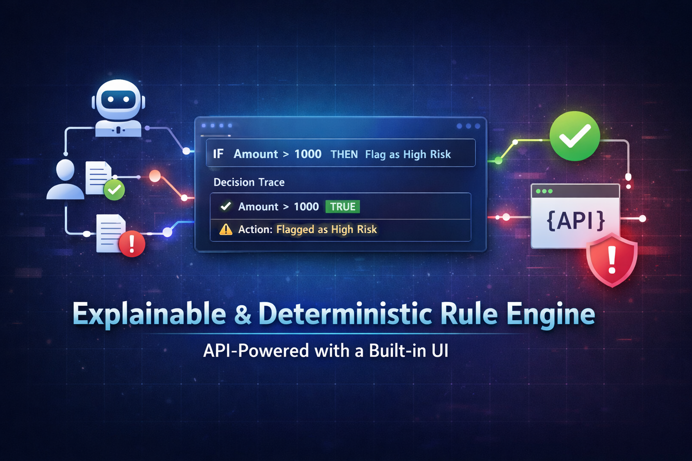
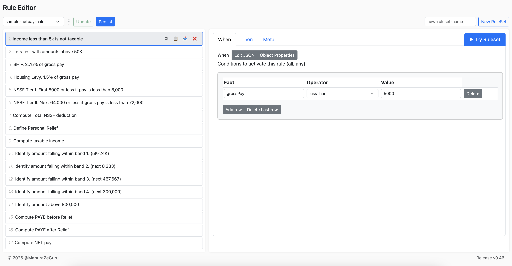
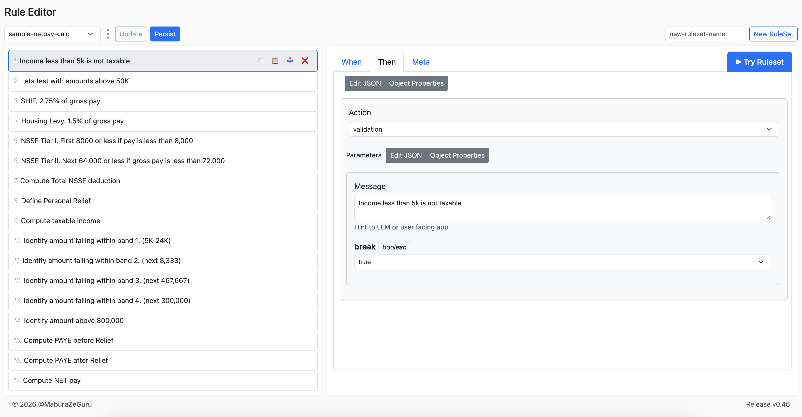
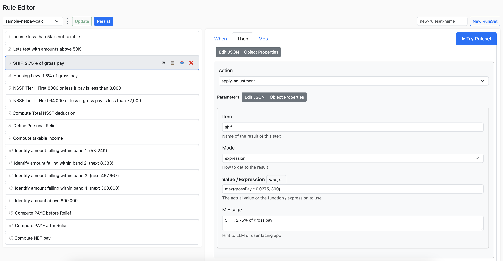
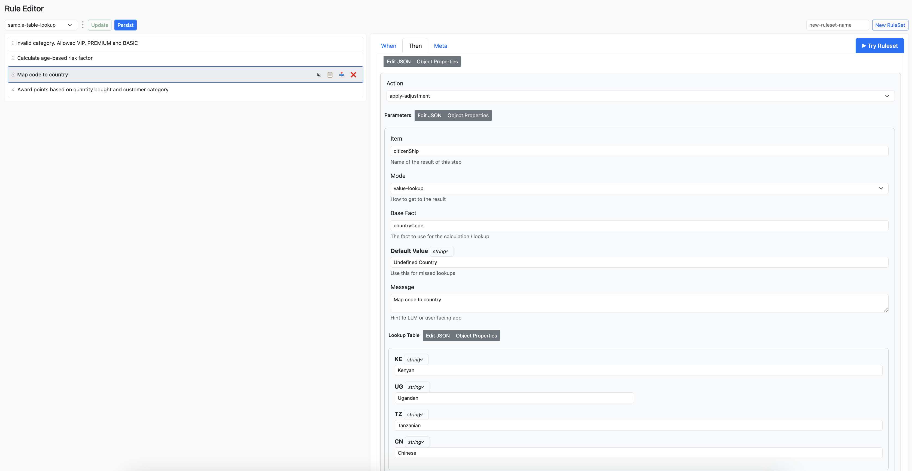
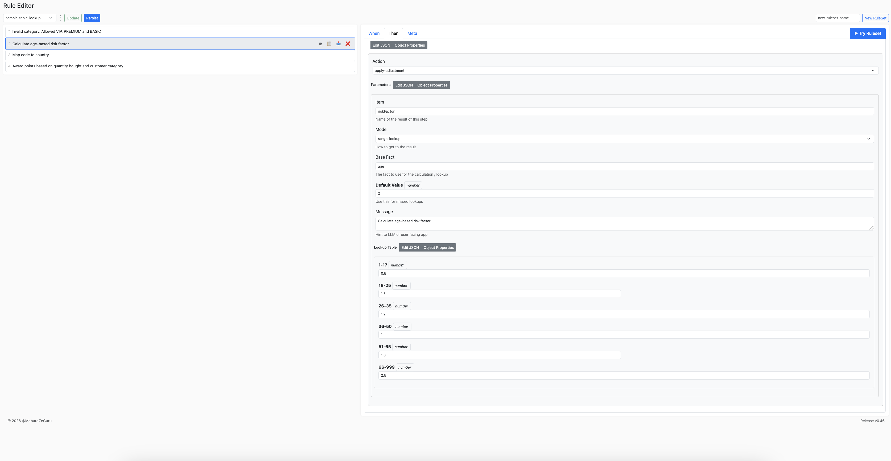
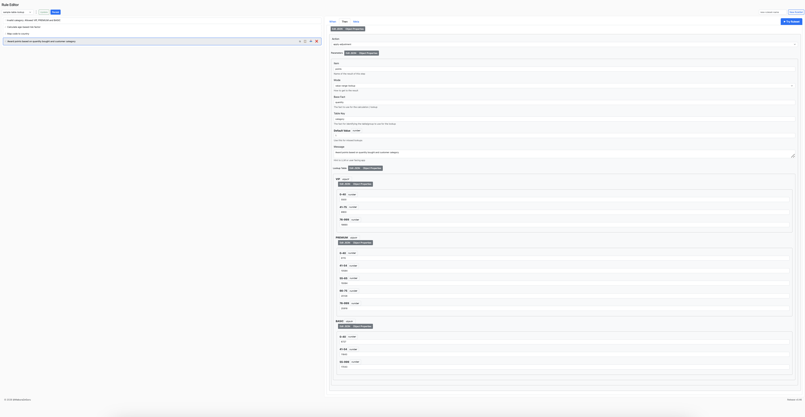
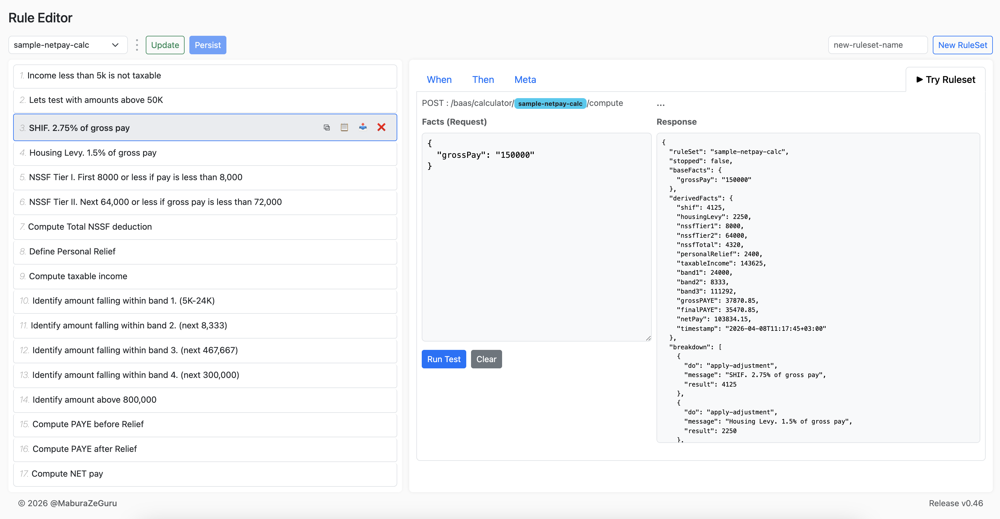

<p align="center">
  <a href="http://nestjs.com/" target="blank"></a>
</p>


BaaS - Business logic As A Service

[](https://sonarcloud.io/summary/new_code?id=zeguru_baas)
[](https://sonarcloud.io/summary?id=zeguru_baas)
[](https://sonarcloud.io/summary?id=zeguru_baas)
[](https://sonarcloud.io/summary?id=zeguru_baas)


# 🚀 BaaS

**Explainable, deterministic rule engine with API and built-in UI**

Power business rules, workflows, and AI guardrails with a fully open-source, developer-friendly engine designed for clarity, control, and auditability.


# Background
There are many awesome rule engines, but

- Expensive, not open source
- Not stack agnostic
- Require heavy coding
- Some lack a decent webui
- Others lack a decision trace
- Hard to plug to context of AI agents 
- Complex DSL


## ✨ Features

* ⚡ Deterministic rule evaluation
* 🧠 Explainable **decision traces** (see exactly *why* a rule passed or failed)
* 🔌 API-first design
* 🖥️ Built-in UI for rule creation and testing
* 🧪 Interactive “try-it” sandbox
* 🐳 Docker-ready for instant setup
* 📦 Sample rules included
* 🤖 Works great as guardrails for AI systems
* Your choice. Create rules using json or a form.

---

## 📸 Overview

**Core flow:**

1. Create a ruleset (container for a group of rules)
2. Add new rules, one by one, via
    - rest api (advanced)
    - copy from another ruleset and paste to destination (recommended)
    - web form  (work in progress)
3. Update ruleset
4. Adjust execution order
    - Meta -> priority
    - Drag and drop
5. Update ruleset
6. Try Ruleset
7. Review response
   * ✅ Results: `derivedFacts`
   * 🧠 Decision trace: `breakdown`
8. Repeat
9. Persist to save to db

---

## 🚀 Quick Start 

### 1. Run with Docker

```bash
docker run -p 3000:3000 zeguru/baas:latest
```

### 2. Access the app

* API: http://localhost:3000/baas
* Editor UI: http://localhost:3000/baas/editor
* OpenApi: http://localhost:3000/baas/docs

---

## Option: Docker Compose

```yaml
version: '3.8'

services:
  app:
    image: zeguru/baas:latest
    ports:
      - "3000:3000"
    environment:
      - NODE_ENV=dev
```

---

### From Source - advanced

```bash
git clone https://github.com/zeguru/baas.git
cd baas
```

### Run with Docker

```bash
docker-compose up --build
```

---
## DSL 

### A. Rule Condition

Define preconditions for rule execution.

Supported Operators:

- `always`
- `isDefined`
- `lessThan`
- `lessThanInclusive`
- `greaterThan`
- `greaterThanInclusive`
- `equal`
- `equalIgnoreCase`
- `notEqual`
- `notEqualIgnoreCase`
- `in`
- `inIgnoreCase`
- `notIn`
- `notInIgnoreCase`



### B. Rule Definition: 

Rule Action: main options: 

- `advice`
- `validation`
- `apply-adjustment`


#### i. advice

Simply logs a message.


#### ii. validation

Message with an option to `break`, ie stop the execution and return immediately.




#### iii. apply-adjustment

Perform a calculation, transformation or a process.

Modes available: 

- `fixed`
- `rate`
- `expression`
- Lookups: `value-lookup`, `range-lookup`, `value-range-lookup`

Expression



Value Lookup



Range Lookup



Value Range Lookup



Try It (sandbox)


---

## 🧪 Example Usage

### Evaluate Business Logic: Calculate Net Pay 

Request

POST `baas/calculator/sample-netpay-calc/compute`

```json
    {
    "grossPay": "150000"
    }
```

Response

`baseFacts` are the original facts passed.

`derivedFacts` includes all computed values.

`breakdown` is the object that explains each fired rule and the result at that instance.
This can be displayed on a user interface or added to the LLM context when used in an AI agent.

`stopped=false` means that the evaluation was not interrupted/stopped by any rule.

```json
{
  "ruleSet": "sample-netpay-calc",
  "stopped": false,
  "baseFacts": {
    "grossPay": "150000"
  },
  "derivedFacts": {
    "shif": 4125,
    "housingLevy": 2250,
    "nssfTier1": 8000,
    "nssfTier2": 64000,
    "nssfTotal": 4320,
    "personalRelief": 2400,
    "taxableIncome": 143625,
    "band1": 24000,
    "band2": 8333,
    "band3": 111292,
    "grossPAYE": 37870.85,
    "finalPAYE": 35470.85,
    "netPay": 103834.15,
    "timestamp": "2026-04-08T11:17:45+03:00"
  },
  "breakdown": [
    {
      "do": "apply-adjustment",
      "message": "SHIF. 2.75% of gross pay",
      "result": 4125
    },
    {
      "do": "apply-adjustment",
      "message": "Housing Levy. 1.5% of gross pay",
      "result": 2250
    },
    {
      "do": "apply-adjustment",
      "message": "NSSF Tier I. First 8000 or less if pay is less than 8,000",
      "result": 8000
    },
    {
      "do": "apply-adjustment",
      "message": "NSSF Tier II. Next 64,000 or less if gross pay is less than 72,000",
      "result": 64000
    },
    {
      "do": "apply-adjustment",
      "message": "Compute Total NSSF deduction",
      "result": 4320
    },
    {
      "do": "apply-adjustment",
      "message": "Define Personal Relief",
      "result": 2400
    },
    {
      "do": "apply-adjustment",
      "message": "Compute taxable income",
      "result": 143625
    },
    {
      "do": "apply-adjustment",
      "message": "Identify amount falling within band 1. (5K-24K)",
      "result": 24000
    },
    {
      "do": "apply-adjustment",
      "message": "Identify amount falling within band 2. (next 8,333)",
      "result": 8333
    },
    {
      "do": "apply-adjustment",
      "message": "Identify amount falling within band 3. (next 467,667)",
      "result": 111292
    },
    {
      "do": "apply-adjustment",
      "message": "Compute PAYE before Relief",
      "result": 37870.85
    },
    {
      "do": "apply-adjustment",
      "message": "Compute PAYE after Relief",
      "result": 35470.85
    },
    {
      "do": "apply-adjustment",
      "message": "Compute NET pay",
      "result": 103834.15
    }
  ]
}
```


### Sample Rule

NB: A single rule is not very useful by itself. Multiple rules need to be grouped into what we call a `ruleset` in order to implement some business logic (eg price calculator, quote generator, etc).

A single rule
```json
{
        "when": {
            "all": [
                { "fact": "numberOfCofeeCups","operator": "greaterThan","value": 3}
            ]
        },
        "then": {
            "do": "advice",
            "with": {
                "message": "Too much coffee detected! Switch to water before you start coding in circles."
            }
        },
        "priority": 10
    }
```

A named group of rules, aka `ruleset`

```json
[
    {
        "when": {
            "all": [
                { "fact": "numberOfCofeeCups","operator": "greaterThan", "value": 3}
                ]
        },
        "then": {
            "do": "advice",
            "with": {
                "message": "Too much coffee detected! Switch to water before you start coding in circles."
            }
        },
        "priority": 10
    },
    {
        "when": {
            "all": [
                { "fact": "numberOfCommitsToday","operator": "lessThan","value": 1}
            ]
        },
        "then": {
            "do": "advice",
            "with": {
                "message": "No commits yet? Time to make some magic happen."
            }
        },
        "priority": 10
    },
    {
        "when": {
            "all": [
                {
                    "fact": "numberOfProductionIncidents","operator": "greaterThanInclusive", "value": 1
                }
            ]
        },
        "then": {
            "do": "advice",
            "with": {
                "message": "Tackling production incidents ? May the force be with you."
            }
        },
        "priority": 10
    },
    {
        "when": {
            "all": [
                {"fact": "releaseDay","operator": "equalIgnoreCase","value": "Friday"}
            ]
        },
        "then": {
            "do": "advice",
            "with": {
                "message": "Deploying on Friday? May the rollback odds be ever in your favor."
            }
        },
        "priority": 10
    },
    {
        "when": {
            "all": [
                {"fact": "numberOfCofeeCups","operator": "lessThanInclusive","value": 3},
                {"fact": "numberOfCommitsToday","operator": "greaterThanInclusive","value": 1},
                {"fact": "numberOfProductionIncidents","operator": "lessThan","value": 1},
                {"fact": "releaseDay","operator": "notEqualIgnoreCase","value": "Friday"}
            ]
        },
        "then": {
            "do": "advice",
            "with": {
                "message": "Balanced caffeine, steady commits, no incidents and no Friday releases. You are living the dream."
            }
        },
        "priority": 5
    }
]
```

---

### Evaluating RuleSets

All the `facts` defined in the `ruleset` must be set and sent as a request. Found under the `when` object.

---


## 🧠 Decision Trace (Explainability)

Every evaluation includes a **breakdown**:

* Shows which rules were evaluated
* Shows the order of evaluation
* Shows the result at each step/rule
* Human readable and usable in Agent context
* Helps in explanations, auditing and debugging purposes

---

## 🧩 Use Cases

* 🛒 Pricing & discount calculator
* 🔐 Product logic
* 💳 Quote Generator
* 🤖 AI input/output guardrails
* 🚀 Add determinism in your AI agents for non-probabilistic business logic
* 📸 Conversational SMS / USSD
* ✅ Session management
* 🤝 Serial input processing
* ⚙️ Backend as a service
* 🖥️ Educational purposes


---

## 🛠️ Development

### Install dependencies

```bash
npm install
```

### Run locally

```bash
npm run start:dev
```

---

## 📁 Project Structure

```
/public         # Editor
/samples        # Sample Rulesets
/readme         # Documentation for sample rulesets
/src/calculator     # Main rule evaluator/calculator
/src/common         # Utils and DTOs
/src/meta           # Dynamic metadata for ui
/src/ruleset        # Ruleset management
/src/session        # Session logic

```

---

## 🤝 Contributing

Contributions are welcome and encouraged!

We need help in

- documentation
- tests
- web ui
- bugfixes

BaaS aims for simplicity. 
- No Hyperlinks
- Clean page
- Few Operations, that work so well

### How to contribute

1. Fork the repository

2. Clone your fork

    ```
    git clone https://github.com/YOUR_USERNAME/baas.git
    cd repo-name
    ```

3. Add upstream (important!)

    This links your local repo to the original repo:

    `git remote add upstream https://github.com/zeguru/baas.git`

    Now you have

        - Original repo → `upstream`
        - Your fork → `origin`

3. Create a feature branch

    ```bash
    git checkout -b feature/amazing-feature
    ```

4. Make changes and Commit

    ```bash
    git add .
    git commit -m "Add amazing feature"
    ```

5. Push to your fork (not upstream!)

    ```bash
    git push origin feature/amazing-feature
    ```

6. Open a Pull Request 

    From your fork

    Target:

        - base repo → original repo (upstream)
        - head repo → your fork (origin)

7. Fill the PR documentation

### NOTEs

Keep your fork updated

a. Sync with upstream

```bash
git checkout main
git fetch upstream
git merge upstream/main
```

b. Push updated main

```
git push origin main
```

---

### Contribution Guidelines

* Keep PRs focused and small
* Document your PR accordingly
* Write clear commit messages
* Add tests where applicable
* Your PR must reference an issue

---

## 🧪 Running Tests

```bash
npm run test:cov
npm run test
```

---

## 📌 Roadmap

* [ ] Rule versioning
* [ ] Execution Stats
* [ ] Support more databases
* [ ] Api key and JWT
* [ ] Rule templates
* [ ] SDK
* [ ] Headless mode (run without editor/docs)

---

## 💬 Feedback & Discussions

* Open an issue for bugs or feature requests
* Use discussions for questions and ideas

---

## 🙌 Credits

Built with:

* NestJS - https://nestjs.com/
* TypeScript
* Node.js
* Json Editor - https://github.com/json-editor/json-editor?tab=readme-ov-file
* The awesome json-rules-engine - https://github.com/CacheControl/json-rules-engine/blob/master/docs/rules.md


Inspired by the need for:

* Stack flexibility 
* Speed - zero deployment
* Explainable product logic
* Transparent decision-making
* Developer-friendly rule systems
* Reliable AI guardrails for business rules

---

## 📄 License

GNU Affero General Public License v3 (AGPL)

---

## ⭐ Support

If you find this project useful:

* Star the repo ⭐
* Share it with others
* Contribute!

---

## 🔥 Final Note

This project aims to be the **decision layer for modern applications**—from traditional systems to AI-powered workflows.

Resist all temptations to make this tool complex !

---
